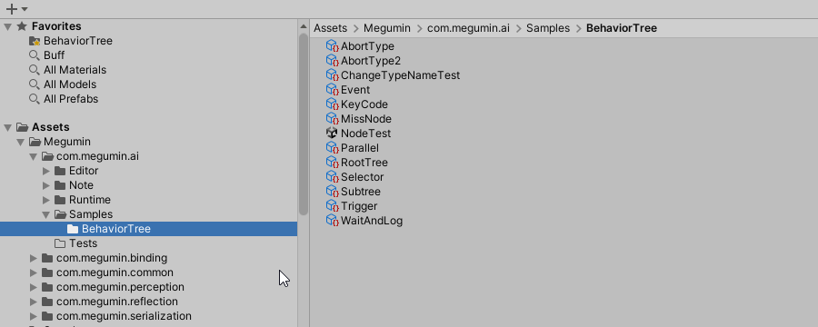
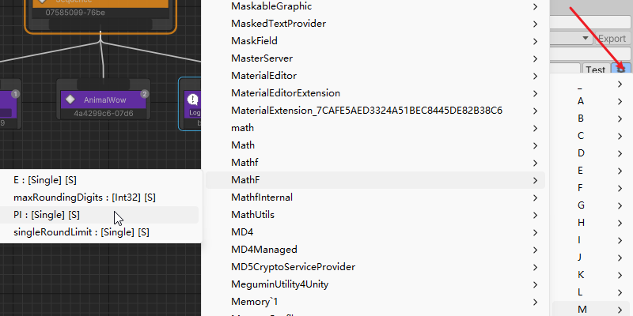
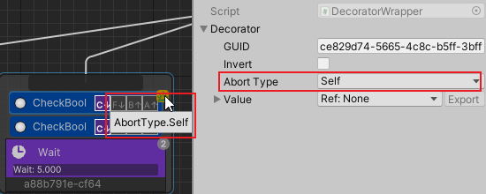
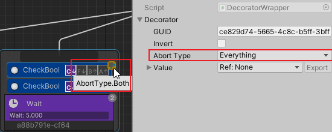

[TOC]

# Overview
BehaviorTree is a tool used to implement complex behaviors that non-players control characters such as monsters and bosses.  
BehaviorTree are currently one of the two most common tools used to implement game character AI, the other being finite state machines.  

Megumin AI BehaviorTree is a behavior tree editor plugin designed for AAA and indie games.  
Provides a visual editor to create behavior trees without writing code. Allows designers to quickly create complex AI.  
It solves many pain points in the use of traditional behavior trees editor, and it is worth trying for users who are not satisfied with traditional behavior trees editor.  

# Installation

## Folder description
After importing the plugin, you can see the following folders:  

- com.megumin.ai    
  Behavior tree runtime and editor code
  + Samples/BehaviorTree    
    Example of a behavior tree asset
- com.megumin.perception    
  AI perception module code
+ com.megumin.binding    
  The parameter binding module code of the Megumin-Plugins。
+ com.megumin.common    
  The public module code of the Megumin-Plugins。
+ com.megumin.reflection    
  The reflection module code of the Megumin-Plugins。
+ com.megumin.serialization    
  The reflection module code of the Megumin-Plugins。

## EditorWindow Introduction
On the editor menu Tools/Megumin/BehaviorTreeEditor, you can open the editor window.  


Editor window description:  

1. Save BehaviorTree Asset. Force save when you double-click the button.
2. Save As BehaviorTree Asset
3. Select the current behavior tree asset in the Projects window
4. File menu
5. Edit menu
6. Editor preferences menu
7. Force reload the behavior tree
8. Debug instance object
9. Variables-table view toggle
10. Help button
11. Editor main view
12. Unity Inspector window, which displays the details of the selected node.

## Create a BehaviorTree asset
In the Project window, Create/Megumin/AI/BehaviorTreeAsset creates a behavior tree asset. Double-click a Behavior Tree asset to open the Behavior Tree Editor.  


# Component
BehaviorTreeRunner is the component that executes the Behavior Tree asset.  
Responsible for initializing the Behavior Tree instance and registering the Behavior Tree instance to the Manager.  
You can set specific execution parameters for the behavior tree.  


InitOption:
- AsyncInit  
  Uses multi-threaded asynchronous instantiation of the behavior tree instance.  
  The disadvantage is that the behavior tree is not completed and executed immediately at the current frame.  
  And the initialization process cannot call the Unity method.
- SharedMeta  
  Same behavior tree file in SharedMeta share meta information, mainly node descriptions, node coordinates and other runtime-independent information.  
- LazyInitSubtree  
  Delayed instantiation of the subtree, instantiated on the first execution to the subtree node.
  The default value is false.
- UseGenerateCode  
  Instantiates the behavior tree using the generated code.
+ DelayRandomFrame  
  Instantiation, delay random frames before starting the execution tree.  
  When a large number of behavior trees are instantiated at the same time and the execution interval is set, the instances can be spread across multiple frame executions to prevent spike frame stuttering.  

If the root behavior tree uses multithreaded initialization, the subtree should be initialized at the same time because the main thread is not blocked.  
If the root behavior tree is initialized using the Unity main thread, you should lazilate initialize the subtree and try not to have a lot of computation happen in the same frame.

RunOption：  
+ FrameInterval  
  Frame execution interval  
+ TimeInterval  
  Game-time execution interval  
+ RealtimeInterval  
  Real-time execution interval  
- Log  
  prints logs  
- Order  
  has no effect for the time being, reserved parameters.  
- OnSucceeded  
  What should be done when the behavior tree is executed successfully, whether to restart the tree.  
- OnFailed  
  What should be done when the behavior tree execution fails, whether to restart the tree.  


# Variable Binding
The variables in the behavior tree can be bound to any component that exists on the same GameObject as BehaviorTreeRunner.  
You can bind a property or field, or you can bind to a static property/field. The data binding can be read-only or read-write.  

When you bind a variable to a member, the member's value is accessed at any time and is the latest value of the member.  
This is very powerful because it implements the behavior tree to directly access the properties of the game logic, and can make a member of an object directly a condition for the execution of the behavior tree without additional coding.  

All bindable variables on the Inspector will have a gear button.  
Left-click the bind button to bring up the bindable menu of components contained on the same GameObject.  


Right-click the bind button, the bindable menu of all components of the current project will pop up, and the project may freeze when there are more components.  


Note: You can bind parameters to members of a component that does not exist on the GameObject, which is legal in the editor. Because this component may not yet exist on prefab, it needs to be added dynamically at runtime.  
However, you must ensure that you add components before the behavior tree starts initializing bindings, or manually call the behavior tree's parameter binding functions after adding components.  
Even if the final bound component does not exist, it does not affect the entire behavior tree execution. When accessing this variable, you can return the default value of the type.  

# Node
## Start Node
You can mark any node of the behavior tree as the start node.  
Execution starts from the start node, ignores the parent node of the mark node, and when the start node execution is complete, the entire behavior tree execution is considered complete.  

## Composite Node
- Sequence  
  A node executes its children in order from left to right. When one of the child nodes fails, the sequence node also stops executing. If there are child nodes that fail, then the sequence fails. If all child node runs of the sequence execute successfully, the sequence node succeeds.  
- Selector  
  A node executes its children in order from left to right. When one of the child nodes executes successfully, the selector node stops executing. If one of the child nodes of the selector runs successfully, the selector runs successfully. If all child nodes of the selector fail to run, the selector fails.  
- Parallel  
  Execute all of its children simultaneously (not multithreaded).    
  There are different behaviors depending on FinishMode:  
  - AnyFailed  
    Any child node fails and returns failure.  
  - AnySucceeded  
    Any child node succeeds and returns success.  
  - AnyCompleted  
    Completes any child node and returns the result of the completed node.  
  - AnySucceededWaitAll  
    Waits for all child nodes to complete, and any one child node succeeds, returning success.  
  - AnyFailedWaitAll  
    Waits for all child nodes to complete, and any one child node fails, returns failure.  

## Action Node
- Wait  
  Wait for the specified number of seconds and return success.  
- Log  
  Generate a log and then return success.  

## Subtree Node
A subtree node can reference another behavior tree asset. Executes from the start node of the subtree.  
The variable table of the parent tree overrides the subtree's variable with the same name.  

## Write a new action node
To create a new action node, you need to using the `Megumin.GameFramework.AI` and `Megumin.GameFramework.AI.BehaviorTree` namespaces.  

Inherit from the `BTActionNode` base class and override the `OnTick` method.

```cs
using System;
using System.Collections.Generic;
using System.ComponentModel;
using Megumin.GameFramework.AI;
using Megumin.GameFramework.AI.BehaviorTree;

[Category("Action")]
public sealed class NewActionNode : BTActionNode
{
    public bool Success = true;
    protected override Status OnTick(BTNode from, object options = null)
    {
        return Success ? Status.Succeeded : Status.Failed;
    }
}
```

# Decorator
You can attach one or more decorators to a Behavior Tree node. This node is called the owner node of the decorator.  
Decorators provide additional functionality for the owner node, or modify the completion result of the owner node.  

- Cooldown  
  After entering or completing the owner node, enter cooling. Only after cooling is complete can it enter the owner node again.  
- Inverte  
  Invert the completion result of the object owner node.  
- Loop  
  Loops execute the owner node a specified number of times.  
- DecoratorLog
  Generates logs when the owner node specifies behavior occurs.  

## ConditionDecorator
The conditional decorator is a special decorator, represented by C↓, executed from top to bottom, and used to determine whether a node can enter. Commonly used conditional decorators include: CheckBool, CheckInt, CheckFloat, CheckString, CheckLayer, CheckTrigger, CheckEvent, CheckGameObject, MouseEvent, KeyCodeEvent.

## Write a new ConditionDecorator
To create a new ConditionDecorator, you need to using `Megumin.GameFramework.AI` and `Megumin.GameFramework.AI.BehaviorTree` namespaces.  

Inherits from the `ConditionDecorator` base class and overrides the `OnCheckCondition` method.   
It is also possible to inherit from the `CompareDecorator` base class and override the `GetResult` and `GetCompareTo` method.  

```cs
using System;
using System.Collections.Generic;
using System.ComponentModel;
using Megumin.GameFramework.AI;
using Megumin.GameFramework.AI.BehaviorTree;

public sealed class NewCondition : ConditionDecorator
{
    protected override bool OnCheckCondition(object options = null)
    {
        return true;
    }
}

public sealed class CheckMyInt : CompareDecorator<int>
{
    public RefVar_Int Left;
    public RefVar_Int Right;

    public override int GetResult()
    {
        return Left;
    }

    public override int GetCompareTo()
    {
        return Right;
    }
}
```

# Conditional Aborts  
When a node has started execution and does not complete, if specific conditions change, abort the currently running node and switch to another node.  
Two abort types: Self and LowerPriority.  

Self abort the lower node.  
  

LowerPriority abort the right node.  
  

Both abort both the right and lower nodes.  
  

# Node Attribute  
When you customize a node, you can use the following attribute to change the default behavior of the node in the editor.  
- [x] Category  
  Sets the category in the editor in the context menu when creating a node.  
- [x] DisplayName  
  Sets the custom name of the node in the editor.  
- [x] Icon  
  Set a custom icon for displaying node in the editor.  
- [x] Description  
  Sets the custom description of the node in the editor.  
- [x] Tooltip  
  Set custom tooltip of the node in the editor.  
- [x] Color  
  Sets the custom color of the node in the editor.  
- [x] HelpURL  
  Sets the help documentation link of the node in the editor.  
- [x] SerializationAlias  
  Sets the serialization alias of the node in the editor. This attribute is useful when custom node class name renamed.  

# Debugging
Select Gameobject at playmode and click EditorTree to open the editor, which will automatically enter debugging mode.  
All changes to debug mode will not change the BehaviorTree asset, and the changes will disappear when playmode is stopped.  


# Contact
- Email: 479813005@qq.com
- Feedback: [Issues · KumoKyaku/Megumin.GameFramework.AI.Samples (github.com)](https://github.com/KumoKyaku/Megumin.GameFramework.AI.Samples/issues)
- QQ Group: [812318008](http://qm.qq.com/cgi-bin/qm/qr?_wv=1027&k=I_oDoO-b1yQs1Em-QvRPG4ZN21RuYM3G&authKey=7TZUwLSCvvCTWo2hnDUwRtlhd733Rc%2BHshrIF%2Fm7p2v7Yo5hxN3hZdWPFnIIIQlf&noverify=0&group_code=812318008)


