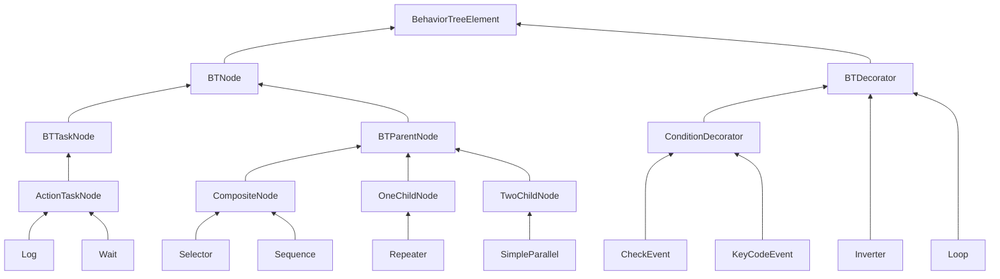
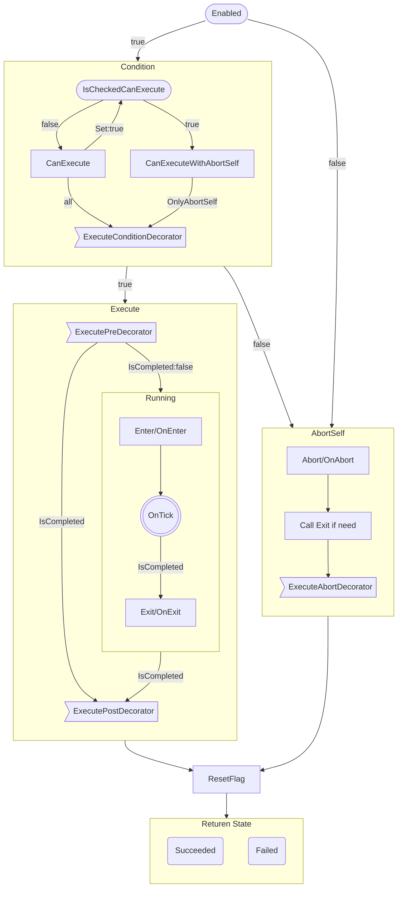

# BehaviorTree

# Introduction
## Summary
A behaviour tree plugin designed for AAA and indie games. Allows quick creation of complex AI.

## Description
- Human intuitive behaviour tree architecture, easier to learn.  
  Adds decorator design. Conditional decorators make the behaviour tree user interface more intuitive and easier to read.  
- Very easy to extend, customise nodes and UI styles with just a few lines of code. 
- Full subtree support and the editor supports multiple windows to edit and Debug both the parent and subtree at the same time. 
- Solves many of the pain points of using traditional behaviour trees and is worth a try for those who are not satisfied with traditional behaviour trees.  

[Samples](https://github.com/KumoKyaku/Megumin.GameFramework.AI.Samples) | [Feedback](https://github.com/KumoKyaku/Megumin.GameFramework.AI.Samples/issues) | [Wiki](https://github.com/KumoKyaku/Megumin.GameFramework.AI.Samples/wiki/BehaviorTree) ]

## Technical details
- Editor built with UIElement.
- Complete C# code, all code is visible, no dlls.
- Architecture designed for interfaces, fully decoupled from business logic, better extensibility.
- Fast splitting of inline subtrees for better decomposition and reuse of AI logic.
- Full performance optimisation for most game requirements.
- Clear code architecture, fully modular code.
- Flexible parameter binding, allowing manual modification of binding paths.

---
---
# Dependencies
- "com.unity.settings-manager": "1.0.3"

1. Open Window -> Package Manager in Unity.
2. Click on the "+" in the top left corner and select "Add package by name".
3. Enter the name of the UPM package, the version is optional.
4. Click the "Add" button and wait for Unity to download and install the UPM package.

# Quick start
# # Basic functions

* [x] Base node library implementation
  * [x] Node generation for Unity default components
  * [x] Visual-auditory-aware components

+ [x] Public parameter binding
+ [x] List Array ~~Dictionary~~
+ [x] Nested generics of up to 2 levels
+ [x] TreeElement circular reference. task references other tasks.
+ [x] Prefabricated body override parameters.

- [ ] StickyNote
- [ ] Group
- [x] Subtree
- [ ] File variants

+ [x] add/remove nodes
+ [x] Connect/Disconnect nodes
+ [x] Copy/paste nodes
+ [x] Reorder child nodes when moving them

* [x] Close editor to prompt for unsaved changes
* [x] Undo/Redo 
* [x] Open cs file by node
* [ ] Open node View file by node
* [x] Node index number

+ [ ] Prompt to terminate affectable nodes when a node is selected

* [ ] TwoChild node creates a unique nodeView

- [x] Save as ScriptObject file
- [ ] Save as Json file
- [x] Automatically open file with editor
- [ ] Generate Behaviour Tree code, eliminate reflections, eliminate bindings
- [ ] Scan all types used by the behavior tree, generate TypeCache.Hot static method code

+ [x] Save Editor User Preferences
+ [x] Editor Log optional settings
+ [ ] Multi-language Log

- [x] Separate editor windows for each behaviour tree file and instance
- [x] Debugging
- [x] Support for simultaneous debugging of multiple instances
- [ ] Remote debugging
- [ ] In-game live editor/behavior tree viewer. (Currently GraphView only supports editors, migrating when unity realtime is supported)

## Supported Attribute
- [x] Category
- [x] DisplayName
- [x] Icon
- [x] HelpURL
- [x] Description
- [x] Tooltip
- [x] Color
- [x] SerializationAlias

## Parameter setting
Instantiated parameters InitOption:  
- AsyncInit  
  Instantiates the behaviour tree asynchronously using multiple threads.  
  The disadvantage is that the behaviour tree is not immediately completed and executed at the current frame.  
  And the initialization process cannot call unity methods.  
- SharedMeta  
  Instances created from the same behaviour tree file, sharing meta information, mainly node descriptions, node coordinates and other runtime irrelevant information.  
- LazyInitSubtree
  Delays the instantiation of a subtree until the subtree node is instantiated at runtime.  
  Default is false.
- UseGenerateCode  
  Instantiates the behaviour tree using the generated code.
+ DelayRandomFrame  
  Delay the number of random frames after instantiation, before starting the execution of the tree.  
  When a large number of behavior trees are instantiated at the same time and the execution interval is set, the instances can be spread out over multiple frames for execution, which is used to prevent spike frame jams.  

If the main behaviour tree is initialised using multiple threads, then the subtree should be initialised at the same time, as it will not block the main thread.  
If the main behaviour tree is initialised using the main Unity thread, then the initialisation of the subtrees should be delayed to try not to have a large number of calculations occur on the same frame.  

Run parameters RunOption:  
+ FrameInterval  
  Frames interval of Tick  
+ TimeInterval  
  Game time interval of Tick  
+ RealtimeInterval  
  Realtime interval of Tick  
- Log  
  Prints a log of key positions such as node switches
- Order  
  Set aside
- OnSucceeded  
  The action that should be taken when the behaviour tree is successfully executed, whether to restart the whole tree or not.
- OnFailed  
  The action that should be taken when the execution of the behavior tree fails, whether to restart the whole tree or not.

---
---
# Architecture details

## Architecture diagram



## Order of execution of node functions
The general process of calling the Tick function internally, read the source code for details.



## Decorator

This library uses a design where the decorator is placed inside the Task and considers the decorator to be part of the Task.  
The basis for this is that in a state machine, a condition node is never a state, but a transition, and transitions are not first class members and cannot exist independently of the state machine, but can only depend on the state node.  

~~I think it is a design failure to put conditional nodes as execution nodes in a behavioural tree.~~

Using a design where the decorator is placed inside the Task, then there are 2 designs as follows:  
1. first judge the condition and then enter the Task (on the basis that the decorator is equivalent to the condition node in the rest of the behaviour tree, and only after the condition node can the Action node be reached)
2. enter the Task first and then judge the condition (the rationale is that if you don't enter the Task, then you shouldn't access the internal content of the Task)   

Which design makes more sense?  

The first design option is currently used.

At the same time, decorators are equivalent to conditional/control nodes in other behaviour trees. So decorator members are similar in structure to Note, and also contain members such as GUIDs.

- [x] `conditional decorator` denoted by C↓, executed from top to bottom to determine if a node is accessible  
- [x] `pre decessor` denoted by F↓, executed from top to bottom Called before entering a node  
- [x] `post decorator` denoted by B↑, executed from bottom to top Called after exiting a node  
- [x] `abort decorator` denoted by A↑, executed from bottom to top Called after exiting a node when termination occurs  

+ If the `conditional decorator` does not pass, the node will not be executed. Pre decorators, post decorators, and abort decorators are not executed.  
+ `post decorator` and `abort decorator` will not be executed at the same time.  
  However, OnAbort OnExit of the node itself is executed.  
  Order of calls on Abort OnAbort --> (if Enter was executed) Exit --> `abort Decorator`

## Subtree
Using a Subtree node, another behavioural tree file can be referenced for use as a subtree.  
- Inline  
  Inline the behaviour tree node of a subtree node into the current tree and use the start node of the subtree, replacing the subtree node.  
  The GUIDs of all subtree nodes are updated to new values when inlining to prevent GUID conflicts.  
- Exporting  
  Select a node to export that node and its children into a new behaviour tree.  
  The GUIDs of all exported nodes are updated to the new values, preventing GUID conflicts.  
  The main purpose is to prevent the user from exporting and then performing an Undo operation, which would result in nodes with the same GUID.  
  Due to the architectural design, it is not possible to analyse the reference relationship between the parameter table and the node, and the referenced parameter table parameters will not follow the export into the new tree.  

`Note: Both inlining and exporting are high-risk operations that can very easily cause irreversible changes to the behaviour tree file. It is strongly recommended to use a version management tool before operating. `

## Parallel
Different behavior depending on FinishMode
- AnyFailed  
  Any child node fails, return failed.
- AnySucceeded  
  Any child node succeeded, success is returned.
- AnyCompleted  
  Returns the result of any completed child node.
- AnySucceededWaitAll  
  Wait for all child nodes to complete, any child node succeeds, return success.
- AnyFailedWaitAll  
  Wait for all child nodes to complete, any child node failed, return failed.

## Polymorphic serialization and generic serialization

- Polymorphic serialization can be used, but if you pay attention, if the serialized object is cleared directly, the rid will change when the new object is reassigned.  
   The rid will not change when the original object is directly modified.
- Generic serialization is only supported in unity2023. The main supported version of the plug-in is still 2021, and this function cannot be relied on at this stage. So it still needs generic specialization.

## Parameter binding
The 4 functions involved in parameter binding are `orthogonal`.

1. Contains a base value to be used as a common member.
2. Contains a Path, which records the members of a component bound to the Agent.  
    Contains a ParseMode for the behavior when the parsing binding fails, including Log, throwing an exception, falling back to the basic value, and falling back to the default value of the type.
3. Contains a RefName, which can be stored in the parameter list collection or shared on multiple nodes. You can also think of this member value as referencing a value in a parameter table.
4. AutoConvert, store a parameter reference, the parameter type of the reference can be inconsistent with the declaration type, use the automatic converter to match.

This library realizes 4 kinds of functional parameters step by step through inheritance. The member values of nodes can be declared as these 4 types.  
If the types 1 and 2 are used, the serialization is directly serialized to the node itself, which is equivalent to being embedded in the node, and does not have a relationship with the outside of the node.  
If the types 3 and 4 are used, the parameters are serialized into the parameter table of the tree, and only the reference Name is serialized in the node itself. When instantiating, the parameters in the parameter table are searched and assigned to the members.

## AutoConvert
There are 2 parts to automatic type conversion.
- The parameter instance Path can be bound to a member of a component of Agent that is different from the declared type of the parameter.
- TODO: A node member value may refer to a parameter instance in the parameter table of a different type than the member declaration.

It is obvious that the more conversions, the lower the performance.

## Class name change
- Serialized member renaming. Guaranteed to still deserialize successfully.
     - Support FormerlySerializedAsAttribute  
     - Support SerializationAliasAttribute  
- Node replacement class name
     - Use the SerializationAliasAttribute attribute to mark the type. Note that the alias must be the full name of the old type, including the namespace.  
     The editor will automatically look for SerializationAlias to ensure that old files can still be deserialized successfully. Change to a new name after saving again.  
     - Or write a static function manually and use TypeCache.HotType to set an alias before deserialization.

It is time-consuming to find Attribute. It is recommended to re-save the existing behavior tree file and update the name after changing the name.  
If you need to resolve the old name at runtime, in the same way, use TypeCache.HotType to set the alias at the start of the game before deserialization.  

## Type change
Node serialization member type change can cause the original behavior tree file deserialization to fail due to type mismatch.  
Use SetMemberByAttribute on a member or node type to specify a callback method on a reflection assignment.  
The member callback method signature is bool FuncName(object memberValue).   
The type callback method signature is bool FuncName(string memberName,object memberValue).  
The method cannot be private or static.

## Node references
You can declare references to nodes containing the Serializable feature in the node.
Using BindingPathSetterAttribute, then you can select the node references of tree species in Inspector.

## Ring topology and diamond topology
- The ring topology is essentially very close to a hierarchical state machine, where each combinatorial node can be seen as a layer of the state machine.
- The diamond topology prevents common logic from being replicated multiple times in the graph.  

**Runtime trees are not structurally constrained. **  
Editor restrictions do not allow ring topology and diamond topology.  
However, users can write behavior tree files manually.  
Exceeding the tree topology will result in spider web like diagrams that lose readability. The user is at liberty to make his own trade-offs.

## Driving method
- event-driven
- Polling-driven (tick-driven)
    - root-leaf  
      Tick from root node to end-leaf node. The advantage is simple implementation and easy to understand.
    - last leaf  
      Record the last executed leaf node and tick the last node each time. The advantage is that the performance is a bit better.  
    - active stack  
      Use the execution stack to record the next node to be executed.  

This library uses `polling-driven root-leaf` mode to execute the behavior tree.

Q: Why not use event-driven behavior tree?  
A: It is too complicated to implement and there is no way to handle the change of parameter binding values.    

Event-driven implementation is based on the existence of Blackboard and Blackboard SetValue triggering update.  
This library does not exist Blackboard, bound without SetValue, similar to the Lazy mode, each time the value is calculated, can not trigger the event, the advantage is not manually SetValue.  
The advantage of event-driven is higher performance, the disadvantage is that there is no tick so the service node is required.  
Polling-driven has the advantage of simple implementation.

## State switching
Q: Should I `go to the next node immediately` after node completion or `next tick go to the next node`?  
A: The `go to next node immediately` design scheme is used.

- You must ensure that one leaf node is running.  
  If the next tick before switching, it will result in the current tick, the current node finished, the next node has not started running. Not intuitive.
- Analogous to a state machine, a state machine does not allow a moment to be in a 2-state sandwich state, always immediately going to the next state.
- A decorator is equivalent to a leaf node of a regular behavior tree. And it is difficult to implement decorators to move to the next decorator only after the next tick.  
  To ensure the consistency of decorators and leaf nodes, it is unified to go to the next node immediately.

## Abort
Proactively ends a node when it has started execution and has not completed.  
When Abort occurs, the child node is called recursively and Abort executes OnAbort Exit AbortDerators.
Eventually exits sequentially from child to parent.

## Conditional Abort

```cs
[Flags]
public enum AbortType
{
    None = 0.
    Self = 1 << 0.
    LowerPriority = 1 << 1.
    Both = Self | LowerPriority
}
```

Two termination types:  
- Self: When Self is in `Running`, each Tick re-values the conditional decorator containing AbortType. If the result changes from true to false, the Self node is terminated and the node returns Failed to its parent.
- LowerPriority: When the `right node` is in `Running`, the parent node additionally re-values the node with `HasAbortLowerPriorityFlag` each Tick.  
  If the execution result of the node `changes`, the node in `Running` is terminated.  
  If the result of the node's execution `does not change`, continue the execution of the node in `Running`.  

Don't be misled by the termination type terminology, different behavior trees implement conditional termination in slightly different ways.  
But in general it is all intuitive. It can be generally understood that when the condition of an already processed node changes, it is allowed to reverse itself, re-execute, and end the node being allowed.

### LowerPriority is handled differently by different parent nodes. 
- Selector  
  Re-value the children of `HasAbortLowerPriorityFlag`.  
- Sequence  
  Re-values only the `conditional decorator containing AbortType.LowerPriority` of the children of `HasAbortLowerPriorityFlag`:  
  - If the revaluation result is true, the node itself is skipped and the execution of the node in `Running` continues.  
  - If the re-valuation result is false, the node in `Running` is terminated and Sequence returns Failed directly.

### Dynamic
- Dynamic is another implementation of conditional abort.  
- Dynamic can only be marked on the parent node.  
- Dynamic has a higher performance overhead than AbortType and is less understandable.  
- **AbortType is strongly recommended over Dynamic.** But still respects the user's choice.  

Dynamic is handled differently by different parent nodes.  
- Selector marked as Dynamic  
  Each Tick re-values all child nodes.  
- Sequence is marked as Dynamic  
  Different from `AbortType.LowerPriority`.  
  Re-values all child nodes every Tick:
  - If this node Succeeded, the execution of the node in `Running` continues.  
  - If this node is Running, the node in `Running` is terminated and this node is executed instead.  
  - If the node Failed, the node in `Running` is terminated and Sequence returns Failed directly.  
  - `Special Note`: If the Sequence contains multiple non-conditional child nodes, the first non-conditional node will always terminate the later non-conditional nodes and re-run. This can cause a dead loop. So don't mark Dynamic for Sequence if you don't need it in particular.

## Event Trigger
Event and Trigger are both tokens recorded in the tree.  

- Event has a lifetime of 1 Tick and is automatically eliminated after 1 Tick.  
  During the validity period, the result of checking Event at any node at any time is true.
- Trigger life cycle is permanent until ResetTrigger.  
  During the validity period, any node checking Event result is true at any time.

Normally the CheckTrigger decorator can choose when to ResetTrigger
- Immediate ResetTrigger immediately after a successful detection
- EnterNode ResetTrigger if it succeeds in entering the node it belongs to after a successful detection.
- LeaveNode ResetsTrigger if it successfully enters the node it belongs to and leaves the node after a successful detection.

The default is Immediate.  
For some use cases, there may be multiple conditional nodes on the node, and if not all of them succeed, the node will not enter execution.  
In this case it may not be desirable to consume the Trigger, so it can be set to EnterNode.

## Performance
Initializing a behavior tree instance may consume a lot of time.  
In particular, initializing the first behavior tree instance may require initializing many static members, which may consume 100~1000ms or even more.  
Multi-threaded initialization is recommended.  

For simple tree instances (within 20 nodes), each Tick is about 0.002ms ~ 0.02ms.  
- The more complex the behavior tree is, the more performance is consumed.  
- Behavior tree depth has a relatively large impact on performance.
- Exceptions can affect performance.  
- Printing Log can seriously affect performance.  

Spiked frames lag, individual frames may consume more than 10x performance, and individual behavior tree instances may take more than 1ms to execute.  
Possible causes:  
- Binding parameter depth is too deep.
- Too many binding parameters.
- Too many conditional abort.  

*Performance is too different from Animator, which is also conservatively estimated to be 10x more powerful than the plugin.*  

Conclusion:  
Object behavior trees that are beyond the scope of the scene should be turned off. Closed behavior trees do not execute, they just take up memory.  
Too many instances of behavior trees should not exist at the same time, no more than 100 is recommended.  

Optimization:  
- Consider manually using multi-threaded execution if it is clear that the behavior tree will not call the main threaded function.  
- Reduce the frequency of behavior tree execution by executing it at fixed intervals and distributing it evenly over multiple frames.  
- Use custom nodes instead of generic nodes and parameter bindings. This is critical for complex behavior tree performance. 
- Generate behavior tree code instead of behavior tree resource files.  

Using behavior trees in the server:  
Behavior tree code should be generated if you want to use a large number of behavior tree instances in the server.  
Even then, trying to execute thousands and thousands of instances at the same time in the server is difficult to achieve.

## Extended Nodes
The default node and the default behavior parameters of the default node may not meet all the needs of the user.  
It is very common for users to extend nodes according to their project needs.  

Inheritance from the base class interface provided by the framework should be preferred.  
If the base class does not meet the requirements, consider inheritance through the interface. A significant portion of the functional editor is supported directly through the interface.  
With any luck, the framework will still work even if the extension node is missing some interfaces.  
As the architecture is refactored, the functionality is always split from the base class to the interface, and the coupling gets lower and lower.

## Final unadopted design
## Asynchronous
Using asynchronous API, for example, parent node calls child node to wait for result, using asynchronous instead of event. running can use asynchronous instead.  

The actual implementation found that using asynchronous should not be Tick driven, only event driven to fully exploit the effect of asynchronous.   
This is a conflicting design with parameter binding. If you force the use of asynchronous, you have to add a binding parameter solver, then keep Tick, and when the parameter value changes, send an event to the behavior tree to simulate event-driven.
It is more tedious to implement using asynchronous. The overhead is much higher. So for the time being, this approach is not used.

---
---
# Reference links
- https://robohub.org/introduction-to-behavior-trees/
